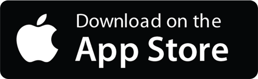

<h1>
    
    Jim's Calorie Counter
    
</h1>

#### An open-source calorie counter app for iPhones. You can use Jim's Calorie Counter to:
- Easily track what you're eating from a meal photo, description, or barcode
- Set goals for your daily calories, protein, carbohydrates, and fats consumption
- See a summary each day's meals and nutrition details from a glance
- Avoid viewing Ads & giving your diet + nutrition data to third-party vendors

And since our project was designed to run locally without any additional APIs, **there are no monthly fees.**

#### Available now via Testflight, 100% free for a limited time:

 *Once live on the App Store, Testflight downloads will be invalidated. Users will be able to re-download using the App Store for a $15 one-time fee.*

#### Join our Discord community:

 *Join us to get help, get involved, download private first-access previews, and **free diet support & accountability!***

## License
This project is licensed under the Creative Commons Attribution-NonCommercial-ShareAlike 4.0 International. See the [LICENSE](./LICENSE.md) file for more details.
